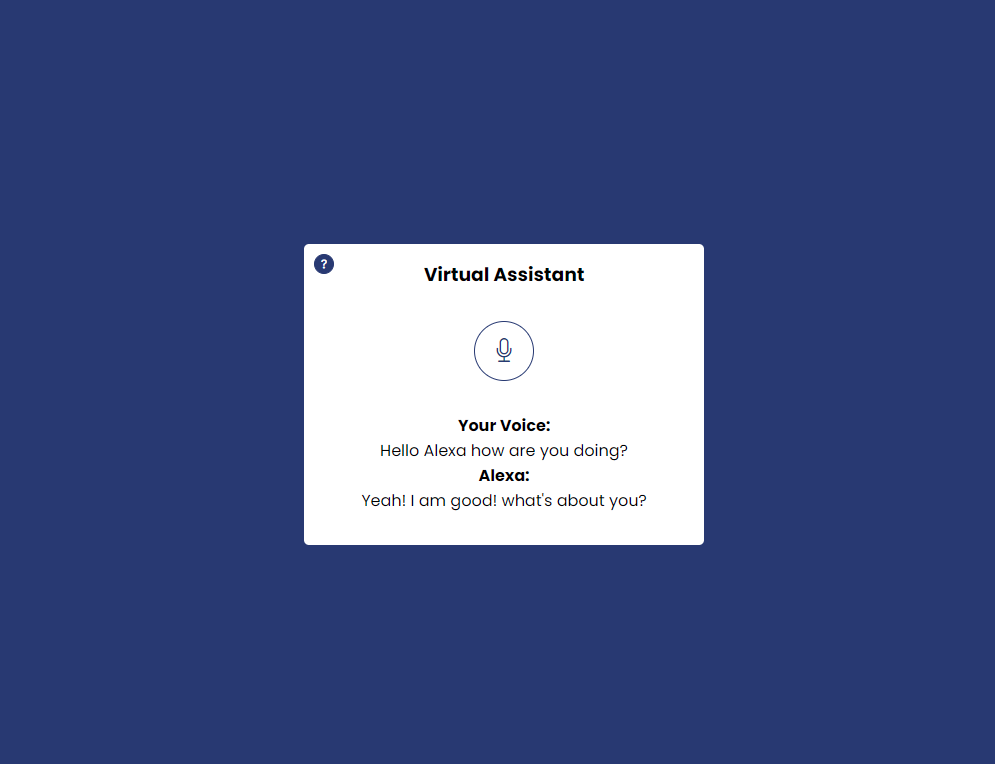

# Virtual Assistant for Chrome

This is simple and limited virtual assistant application using vanilla javascript. Here you will get a lot of features like if you wanna ask basic question the terms of your question it reply you.

# Using Technologies 
- HTML5/HTML
- CSS3/CSS
- Bootstrap5 Framework
- Vanilla JavaScript
- Browser API
- VS Code Editor
- Github / Git bash
- Windows Terminal
many more....

# Features
- Get a voice system
- And give some command
- Just checkout all

# Demo Link - Here

# Demo Preview screenshot here

> Thanks for reach out me on github.